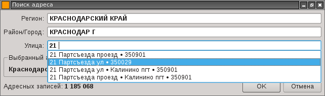

## Поиск адреса в федеральной информационной адресной системе (ФИАС)

Приложение предназначено для быстрого оффлайнового поиска/ввода адреса из справочника **[ФИАС](http://fias.nalog.ru)**.
Целиком и полностью ориентировано на русскоязычных пользователей. Изначально разработано для
совместного использования с базами данных в IBM Notes (Lotus Notes), но не ограничено только этой областью.

Состоит из двух частей:

* **fiasimport** - конвертер из справочника ФИАС в XML формате во внутреннюю базу данных;
* **inputaddr** - диалог поиска адреса по справочнику.

Окно диалога поиска адреса показано на изображении ниже.



После завершения диалога ввода, приложение выводит информацию о выбранном адресе на стандартный вывод
 и в буфер обмена в формате показанном ниже:


```
addr_fullname:Краснодарский край, Краснодар г, 21 Партсъезда проезд
region_name:Краснодарский
region_short:край
area_name:
area_short:
city_name:Краснодар
city_short:г
town_name:
town_short:
street_name:21 Партсъезда
street_short:проезд
street_aoguid:0ca05eb1-9d56-4a60-a576-d8d9e5bbc57c
street_postalcode:350901
```

Адресный справочник для импорта можно получить на сайте [ФИАС](http://fias.nalog.ru) в разделе **Обновления**.

## Зависимости

Приложение зависит от библиотеки **Qt4** и от движка баз данных **Tokyo Cabinet** (включено в 3rdparty).

## Сборка для Linux

Получение исходного кода:

    git clone https://github.com/mkv/inputaddr
    cd inputaddr
    git submodule init

Сборка **Tokyo Cabinet** из состава **EJDB**:

    cd 3rdparty/ejdb/tcejdb
    ./configure
    make -j3
    cd -

Сборка программы для импорта справочника:

    cd fiasimport
    qmake
    make -j3
    cd -

Сборка программы диалога поиска адреса:

    cd inputaddr
    qmake
    make -j3
    cd -

Проверка работы:

    export LD_LIBRARY_PATH=$(pwd)/3rdparty/ejdb/tcejdb
    cd bin
    ./fiasimport /PATH_TO/AS_ADDROBJ_20140816_c17b4d6a-70cb-413a-ae3e-42e21c906d41.XML
    ./inputaddr

## Сборка для Windows

Я пока постесняюсь публиковать этот процесс,
т.к. благодаря использованию **Tokyo Cabinet** он состоит чуть менее чем полностью из костылей.
Несколько исправляет ситуацию работа проделанная автором **EJDB**. За что ему огромное **спасибо**!
